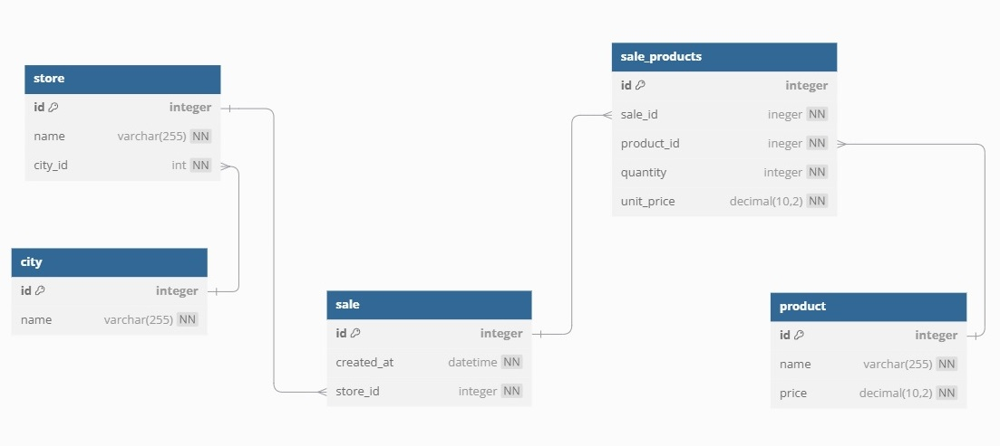

# Оглавление
- [Постановка задачи](#Постановка-задачи)
- [Установка и запуск](#Установка-и-запуск)
  - [Среда разработки](#Среда-разработки)
  - [Производственная среда](#Производственная-среда)
  - [Без Docker](#Без-Docker)
- [Используемые библиотеки](#Используемые-библиотеки)
- [Модель базы данных](#Модель-базы-данных)
- [Архитектура приложения](#Архитектура-приложения)
- [Структура проекта](#Структура-проекта)
- [Эндпоинты](#Эндпоинты)
  - [Города](#Города)
  - [Магазины](#Магазины)
  - [Товары](#Товары)
  - [Продажи](#Продажи)
- [Тестирование](#Тестирование)
# Постановка задачи:
## Создать API для управления продажами в сети магазинов бытовой техники
### Используемый стэк
- Фреймворк для разработки -  FastAPI
- База данных - Postgres

### Сущности системы
- Товар
- Магазин
- Город (в одном городе может быть несколько магазинов)
- Продажи (одна продажа может содержать несколько товаров)

### Функциональность
- CRUD-операции на сущности Товар, Магазин, Город, Продажи
- Методы api для:
	- Получения продаж в разрезе:
		- Каждого города
		- Каждого магазина
		- Каждого товара
	- Получения продаж за последние **N** суток
	- Получения продаж с суммой более (или менее) **N**  денежных единиц
	- Получения продаж с количеством товаров более (или менее) **N** штук
	- Получения конкретных продаж (по идентификатору)
	- Все перечисленные выше пункты (в контексте продаж) должны быть комбинируемы (например, иметь возможность одновременно выбирать продажи с суммой более 5000 руб. и из города Владивостока) (* задача со звездочкой - считать как доп. балл)


### Дополнительные требования, Будет плюсом но не обязательно.
- Обеспечить миграции БД
- Обернуть в docker-контейнер
- Составить docker-compose

# Установка и запуск:
- ## Среда разработки
    ### Особенности среды:
    - Логируются SQL запросы
    - Создается отдельная база данных для тестирования
    ### Требования к запуску:
    - Docker Desktop
    ### Запуск проекта:
    #### 1. Клонировать репозиторий
    ```bash                                                    
    git clone https://github.com/E-n-d-l-e-s-s-A-I/DNS-Test-Task
    ```
    #### 2. Запустить Docker Desktop
    #### 3. Запустить docker-compose в корне проекта
    ```bash                                                    
    docker-compose -f docker-compose.dev.yaml up --build --force-recreate 
    ```
    #### 4. Теперь приложение запущено на [`http://127.0.0.1:5000/`](http://127.0.0.1:5000/)
    Ознакомится с конечным точками API можно по адресу [`http://127.0.0.1:5000/docs`](http://127.0.0.1:5000/docs)
    #### 5. При необходимости можно заполнить БД тестовыми данными
    ```bash                                                    
    docker exec -it sales_app_dev python -m app.db.test_data.test_data_scripts
    ```
    Скрипт пересоздает таблицы и заполняет их тестовыми данными
    #### 6. Запуск тестов
    ```bash                                                    
    docker exec -it sales_app_dev pytest
    ```
- ## Производственная среда
    ### Особенности среды:
    - Логирование SQL запросов отключено
    - База данных для тестов не создается
    ### Требования к запуску:
    - Docker Desktop
    ### Запуск проекта:
    #### 1. Клонировать репозиторий
    ```bash                                                    
    git clone https://github.com/E-n-d-l-e-s-s-A-I/DNS-Test-Task
    ```
    #### 2. Запустить Docker Desktop
    #### 3. Запустить docker-compose в корне проекта
    ```bash                                                    
    docker-compose up --build --force-recreate
    ```
    #### 4. Теперь приложение запущено на [`http://127.0.0.1:5000/`](http://127.0.0.1:5000/)
    Ознакомится с конечным точками API можно по адресу [`http://127.0.0.1:5000/docs`](http://127.0.0.1:5000/docs)
    #### 5. При необходимости можно заполнить БД тестовыми данными
    ```bash                                                    
    docker exec -it sales_app python -m app.db.test_data.test_data_scripts
    ```
    Скрипт пересоздает таблицы и заполняет их тестовыми данными
- ## Без Docker
    ### Особенности среды:
    - Аналогичны среде разработки
    ### Требования к запуску:
    - Интерпретатор python
    - Postgres
    ### Запуск проекта:
    #### 1. Клонировать репозиторий
    ```bash                                                    
    git clone https://github.com/E-n-d-l-e-s-s-A-I/DNS-Test-Task
    ```
    #### 2. Активировать виртуальное окружение и установить зависимости
    В корне проекта выполнить консольные команды:
    ```bash
    python -m venv venv
    venv\scripts\activate
    pip install -r requirements.txt
    ```
    #### 3. Создать базу данных в Postgres
    Конфигурация находится в .env
    ```bash                                                    
    POSTGRES_DB=sales
    POSTGRES_USER=postgres
    POSTGRES_PASSWORD=root
    DB_HOST=localhost
    ```
    #### 4. Выполнить миграции
    В корне проекта
    ```bash                                                    
    alembic upgrade head
    ```
    #### 5. При необходимости можно заполнить БД тестовыми данными
    В корне проекта
    ```bash                                                    
    python -m app.db.test_data.test_data_scripts
    ```
    #### 6. Запустить сервер
    В корне проекта
    ```bash                                                    
    uvicorn app.main:app --reload
    ```
    #### 7. Теперь приложение запущено на [`http://127.0.0.1:8000/`](http://127.0.0.1:8000/)
    Ознакомится с конечным точками API можно по адресу [`http://127.0.0.1:8000/docs`](http://127.0.0.1:8000/docs)

    #### 8. Для запуска тестов создать базу данных в Postgres
    Конфигурация находится в .env
    ```bash                                                    
    TEST_POSTGRES_DB=sales_test
    TEST_POSTGRES_USER=postgres
    TEST_POSTGRES_PASSWORD=root
    TEST_DB_HOST=localhost
    ```
    #### 9. Запуск тестов
    В корне проекта
    ```bash                                                    
    pytest
    ```
# Используемые библиотеки:
- _fastapi_ - для создания самого API
- _sqlalchemy_ - для работы с базой данных через ORM
- _asyncpg_ - асинхронный движок для работы с PostgreSQL
- _alembic_ - для управления миграциями базы данных
- _pytest_ - для написания автоматических тестов

# Модель базы данных:
Исходя из предметной области была спроектирована следующая база данных:

1) **City**
   - **id**: INTEGER, PRIMARY KEY, автоинкрементный
   - **name**: VARCHAR(255), NOT NULL, UNIQUE

2) **Store**
   - **id**: INTEGER, PRIMARY KEY, автоинкрементный
   - **name**: VARCHAR(255), NOT NULL, UNIQUE
   - **city_id**: INTEGER, FOREIGN KEY, ON_DELETE=CASCADE, NOT NULL, ссылается на `id` в таблице City

3) **Product**
   - **id**: INTEGER, PRIMARY KEY, автоинкрементный
   - **name**: VARCHAR(255), NOT NULL, UNIQUE
   - **price**: Decimal(10, 2), NOT NULL, должна быть больше 0

4) **Sale**
   - **id**: INTEGER, PRIMARY KEY, автоинкрементный
   - **created_at**: DATETIME, NOT NULL
   - **store_id**: INTEGER, NOT NULL, ссылается на `id` в таблице Store

5) **Sale_products** - связывающая **Product** и **Sale** таблица
   - **id**: INTEGER, PRIMARY KEY, автоинкрементный
   - **sale_id**: INTEGER, FOREIGN KEY, ON_DELETE=CASCADE, NOT NULL, ссылается на `id` в таблице Sale
   - **product_id**: INTEGER, FOREIGN KEY, ON_DELETE=CASCADE, NOT NULL, ссылается на `id` в таблице Product
   - **quantity**: INTEGER, NOT NULL, количество товара в продаже, должно быть больше 0
   - **unit_price**:  Decimal(10, 2), NOT NULL, цена товара на момент продажи, должна быть больше 0




# Архитектура приложения

В приложении для абстрагирования доступа к данным был применён паттерн **«Репозиторий»**. Реализован базовый репозиторий, который поддерживает основные CRUD-операции. Для каждой модели данных создаётся отдельный репозиторий, наследуемый от базового, который может при необходимости расширять его функционал. Базовый репозиторий расположен в модуле **`app/utils/repository.py`**.

Для каждой сущности системы создана отдельная директория с модулями:
 - `models.py` - Содержит SQLAlchemy модели
 - `repository.py` - Содержит реализацию репозитория для данной сущности
 - `router.py` - Содержит эндпоинты
 - `schemas.py` - Содержит Pydantic схемы

# Структура проекта
    DNS-Test-Task/
    ├── app/                              # Основная директория всего приложения
    │   ├── api/                            # Пакет с сущностями системы
    │   │   ├── __init__.py                     
    │   │   ├── cities/
    │   │   │   ├── models.py
    │   │   │   ├── repository.py
    │   │   │   ├── router.py
    │   │   │   └── schemas.py
    │   │   ├── ...
    │   │   └──stores/
    │   ├── db/                           # Директория с модулями для работы с БД
    │   │   ├── migrations/                 # Директория с миграциями
    │   │   ├── test_datas/                 # Директория с тестовыми данными и скриптами для работы с ними
    │   │   ├── abstract_models.py          # Модуль с абстрактными SQLAlchemy моделями
    │   │   ├── abstract_models.py          # Модуль с кастомными аннотируемыми типами для моделей
    │   │   └── database.py                 # Модуль с классом для работы с БД
    │   │    
    │   ├── tests/                          # Директория с тестами
    │   │   ├── cities/
    │   │   ├── ...
    │   │   └── conftest.py
    │   ├── utils/                          # Директория с модулями, общими для всех сущностей
    │   |   ├── exceptions.py                 # Модуль с классами ошибок
    │   |   ├── repository.py                 # Модуль с базовым репозиторием
    │   |   ├── shemas.py                     # Модуль с Pydantic схемами
    │   |   └── validators.py                 # Модуль с валидаторами для Pydantic схем
    │   |
    │   ├── config.py                       # Конфигурационный модуль приложения
    │   ├── conftest.py                     # Конфигурационный модуль для тестов 
    │   |  
    │   └── main.py                         # Точка входа в программу
    │
    ├── docker_scripts/                     # Директория со скриптами для контейнеров
    │
    ├── envs/                               # Директория со средами
    │   ├── .env                              # Стандартная среда разработки
    │   ├── .env-develop                      # Среда разработки для docker-compose
    |   └── .env-prod                         # Производственная среда для docker-compose
    │
    ├── readme_images/                      # Директория с картинками для README
    |
    ├── .gitignore                          # .gitignore
    ├── Dockerfile                          # Dockerfile приложения
    ├── README.md                           # README приложения
    ├── alembic.ini                         # Инициализация Alembic
    ├── docker-compose.dev.yaml             # Docker-compose для среды разработки
    ├── docker-compose.yaml                 # Docker-compose для производственной среды
    ├── pytest.ini                          # Инициализация pytest
    └── requirements.txt                    # Файл с зависимостями

# Эндпоинты
1. ## Города
- **GET /cities**
  - Описание: Получение списка всех городов
  - Ответ: Возвращает массив городов с их ID и названиями
	```json
	[
      {
        "id": 1,
        "name": "Название города",
      },
      "{... more cities ...}"
	]
	```

- **POST /cities**
  - Описание: Добавление нового города
  - Тело запроса: 
  ```json
  {
    "name": "Название города"
  }
  ```
  - Ответ: Возвращает ID добавленного города
  ```json
  {
    "id": 3
  }
  ```
  - Ошибки:
    - 409 Conflict: При нарушении целостности бд. Например, если город с таким `name` уже существует в бд
    - 422 Unprocessable Entity: При некорректном теле запроса. Например, если `name` города это число

- **Get /cities/{city_id}**
  - Описание: Получение города по ID
  - Ответ: Возвращает название и ID города
  ```json
  {
    "id": 1,
    "name": "Название города"
  }
  ```
  - Ошибки:
    - 404 Not Found: Если город с таким `city_id` не найден

- **Patch /cities/{city_id}**
  - Описание: Частичное обновление информации о городе
  - Тело запроса: 
  ```json
  {
    "name": "Новое название города"
  }
  ```
  - Ответ: Возвращает ID и обновленное название города
  ```json
  {
    "id": 1,
    "name": "Новое название города"
  }
  ```
  - Ошибки:
    - 404 Not Found: Если город с таким `city_id` не найден
    - 409 Conflict: При нарушении целостности бд. Например, если город с таким `name` уже существует в бд
    - 422 Unprocessable Entity: При некорректном теле запроса. Например, если `name` города это число

- **Delete /cities/{city_id}**
  - Описание: Удаление города по ID
  - Ответ: Возвращает название и ID удаленного города
  ```json
  {
    "id": 1,
    "name": "Название города"
  }
  ```
  - Ошибки:
    - 404 Not Found: Если город с таким `city_id` не найден

2. ## Магазины
- **GET /stores**
  - Описание: Получение списка всех магазинов
  - Ответ: Возвращает массив магазинов с их ID, названиями и ID города
	```json
    [
      {
        "id": 1
        "name": "Название магазина",
        "city_id": 1
      },
      "{... more stores ...}"
    ]
	```

- **POST /stores**
  - Описание: Добавление нового магазина
  - Тело запроса: 
  ```json
  {
    "name": "Название магазина",
    "city_id": 1
  }
  ```
  - Ответ: Возвращает ID добавленного магазина
  ```json
  {
    "id": 1
  }
  ```
  - Ошибки:
    - 409 Conflict: При нарушении целостности бд. Например, если города с таким `city_id` не существует в бд
    - 422 Unprocessable Entity: При некорректном теле запроса. Например, если `name` магазина это число
  
- **Get /stores/{store_id}**
  - Описание: Получение магазина по ID
  - Ответ: Возвращает название магазина, ID магазина и ID города
  ```json
  {
    "id": 1,
    "name": "Название магазина",
    "city_id": 1
  }
  ```
  - Ошибки:
    - 404 Not Found: Если магазин с таким `store_id` не найден

- **Patch /stores/{store_id}**
  - Описание: Частичное обновление информации о магазине
  - Тело запроса: 
  ```json
  {
    "name": "Новое название магазина",
    "city_id": 1
  }
  ```
  - Ответ: Возвращает ID магазина и обновленные название магазина и ID города
  ```json
  {
    "id": 1,
    "name": "Новое название магазина",
    "city_id": 1
  }
  ```
  - Ошибки:
    - 404 Not Found: Если магазин с таким `store_id` не найден
    - 409 Conflict: При нарушении целостности бд. Например, если города с таким `city_id` не существует в бд
    - 422 Unprocessable Entity: При некорректном теле запроса. Например, если `name` магазина это число

- **Delete /stores/{store_id}**
  - Описание: Удаление магазина по ID
  - Ответ: Возвращает ID удаленного магазина, название магазина и ID города
  ```json
  {
    "id": 1,
    "name": "Название магазина",
    "city_id": 1
  }
  ```
  - Ошибки:
    - 404 Not Found: Если магазин с таким `store_id` не найден

3. ## Товары

- **GET /products**
  - Описание: Получение списка всех товаров
  - Ответ: Возвращает массив товаров с их ID, названиями и ценой
	```json
    [
      {
        "id": 1,
        "name": "Название товара",
        "price": "11.11"
      },
      "{... more products ...}"
     ]
	```

- **POST /products**
  - Описание: Добавление нового товара
  - Тело запроса: 
  ```json
  {
    "name": "Название товара",
    "price": 11.11
  }
  ```
  \*`price` - должно быть числом > 0 и с количеством знаков после запятой <= 2
  - Ответ: Возвращает ID добавленного товара
  ```json
  {
    "id": 1
  }
  ```
  - Ошибки:
    - 409 Conflict: При нарушении целостности бд. Например, если товар с таким `name` уже существует в бд
    - 422 Unprocessable Entity: При некорректном теле запроса. Например, если `price` задан с неправильным количеством знаков после запятой

- **Get /products/{product_id}**
  - Описание: Получение товара по ID
  - Ответ: Возвращает название товара, ID товара и его цену
  ```json
  {
    "id": 3,
    "name": "Название товара",
    "price": "11.00"
  }
  ```
  - Ошибки:
    - 404 Not Found: Если товар с таким `product_id` не найден

- **Patch /products/{product_id}**
  - Описание: Частичное обновление информации о товаре
  - Тело запроса: 
  ```json
  {
    "name": "Новое название товара",
    "price": "11.11"
  }
  ```
  \*`price` - должно быть числом > 0 и с количеством знаков после запятой <= 2
  - Ответ: Возвращает ID товара и обновленные название товара и цену
  ```json
  {
    "id": 1,
    "name": "Новое название товара",
    "price": "11.11"
  }
  ```
  - Ошибки: 
    - 404 Not Found: Если товар с таким`product_id` не найден
    - 409 Conflict: При нарушении целостности бд. Например, если товар с таким `name` уже существует в бд
    - 422 Unprocessable Entity: При некорректном теле запроса. Например, если `price` задан с неправильным количеством знаков после 

- **Delete /products/{product_id}**
  - Описание: Удаление товара по ID
  - Ответ: Возвращает ID удаленного товара, название товара и его цену
  ```json
  {
    "id": 1,
    "name": "Название товара",
    "price": "11.11"
  }
  ```
  - Ошибки:
    - 404 Not Found: Если товар с таким `product_id` не найден

4. ## Продажи
    
При запросах к эндпоинтам продаж следует учитывать:
1. Для товаров продажи всегда возвращается цена на момент добавления их в продажу
2. Общая сумма продажи без товаров считается 0
3. Общее количество товаров в продаже без товаров считается 0

- **GET /sales**
  - Описание: Получение списка товаров с учетом параметров запроса
  - Параметры: 
    - `city_id: int` - ID города, в котором была совершена продажа
    - `store_id: int` - ID магазина, где совершена продажа
    - `product_id: int` - ID товара, который должен присутствовать в продаже
    - `days: int` - Максимальное количество дней прошедшее с момента продажи, включительно
    - `min_amount: decimal` - Минимальная общая сумма продажи, включительно
    - `max_amount: decimal` Максимальная общая сумма продажи, включительно
    - `min_quantit: int` - Минимальное количество товаров в продаже, включительно
    - `max_quantity: int` - Минимальное количество товаров в продаже, включительно
  - Особенности запроса:
    - Все параметры могут быть комбинируемыми
    - Неизвестные параметры игнорируются
    - Параметры валидируются только приведением к указанным типам
    - Параметры могут принимать неположительные значения
    - При взаимоисключающих параметрах возвращается пустой список
    - При недействительных параметрах ID возвращается пустой список
  - Пример запроса: `/sales?city_id=1&product_id=1&min_amount=100&max_amount=1000`. Возвращает продажи из города с ID=1, в которых присутствует товар с ID=1, Общая сумма которых лежит в диапазоне [100, 1000]

  - Ответ: Возвращает массив продаж. Продажа состоит из: ID продажи, ID магазина, массива товаров продажи, общей суммы и общего количества товаров
	```json
    [
      {
        "id": 1,
        "store_id": 1,
        "products": [
          {
            "product_id": 1,
            "quantity": 1,
            "unit_price": "11.11"
          },
          "{... more products ...}"
        ],
        "total_amount": "11.11",
        "total_quantity": 1
      },
      "{... more sales ...}"
    ]
	```
  - Ошибки:
    - 422 Unprocessable Entity: Если не удалось привести параметры запроса к указанным типам. Например, если `city_id` это строка.


- **POST /sales**
  - Описание: Добавление новой продажи
  - Тело запроса: 
  ```json
  {
    "store_id": 1,
    "products": [
      {
        "product_id": 1
        "quantity": 1,
      },
      "{... more products ...}"
    ]
  }
  ```
  \*`quantity` - должно быть целым числом > 0

  \*в `products` не должно быть повторяющихся товаров
  - Ответ: Возвращает ID добавленной продажи
  ```json
  {
    "id": 1
  }
  ```
  - Ошибки:
    - 409 Conflict: При нарушении целостности бд. Например, если магазин с `store_id` не существует в бд
    - 422 Unprocessable Entity: При некорректном теле запроса. Например, если `quantity` меньше 1

- **Get /sales/{sale_id}**
  - Описание: Получение продажи по ID
  - Ответ: Возвращает ID продажи, ID магазина, массив товаров продажи, общую сумму и общее количество товаров
  ```json
  {
    "id": 1,
    "store_id": 1,
    "products": [
      {
        "product_id": 1,
        "quantity": 1,
        "unit_price": "12.11"
      },
      "{... more products ...}"
    ],
    "total_amount": "11.11",
    "total_quantity": 1
  }
  ```
  - Ошибки:
    - 404 Not Found: Если продажа с таким`sale_id` не найдена

- **Patch /sales/{sale_id}**
  - Описание: Частичное обновление информации о самой продаже, но не о товарах продажи. Взаимодействие с товарами продажи происходит по эндпоинтам *`/sales/{sale_id}/products/...`*
  - Тело запроса: 
  ```json
  {
    "store_id": 2
  }
  ```
  - Ответ: Возвращает ID продажи и обновленные ID магазина, массив товаров продажи, общую сумму и общее количество товаров
  ```json
  {
    "id": 1,
    "store_id": 2,
    "products": [
      {
        "quantity": 1,
        "product_id": 1,
        "unit_price": "11.11"
      },
      "{... more products ...}"
    ],
    "total_amount": "11.11",
    "total_quantity": 1
  }
  ```
  - Ошибки:
    - 404 Not Found: Если продажа с таким `sale_id` не найдена
    - 409 Conflict: При нарушении целостности бд. Например, если магазин с таким `store_id` не существует в бд
    - 422 Unprocessable Entity: При некорректном теле запроса. Например, если `store_id` не число

- **Delete /sales/{sale_id}**
  - Описание: Удаление продажи по ID
  - Ответ: Возвращает ID удаленной продажи, ID магазина, массив товаров продажи, общую сумму и общее количество товаров
  ```json
  {
    "id": 1,
    "store_id": 2,
    "products": [
      {
        "quantity": 1,
        "product_id": 1,
        "unit_price": "12.11"
      },
      "{... more products ...}"
    ],
    "total_amount": "11.11",
    "total_quantity": 1
  }
  ```
  - Ошибки:
    - 404 Not Found: Если продажа с таким `sale_id` не найдена

- **Get /sales/{sale_id}/products**
  - Описание: Получение продажи и ее списка товаров по ID. В отличие от **`Get /sales/{sale_id}`** возвращает детальную информации о каждом товаре, включая его название
  - Ответ: Возвращает продажу и массив товаров с детальной информацией
  ```json
  {
    "id": 1,
    "store_id": 1,
    "products_details": [
      {
        "id": 1,
        "name": "string",
        "quantity": 1,
        "unit_price": "11.11"
      },
      "{... more products ...}"
    ],
    "total_amount": "11.11",
    "total_quantity": 1
  }
  ```
  - Ошибки:
    - 404 Not Found: Если продажа с таким `sale_id` не найдена

- **POST /sales/{sale_id}/products**
  - Описание: Добавление нового товара в продажу. Добавляет именно еще не присутствующий в продаже товар. Если товар уже присутствует в продаже вернет 409. Для взаимодействия с ним стоим обращаться к эндпоинту **`/sales/{sale_id}/products/{product_id}`**
  - Тело запроса: 
  ```json
  {
    "quantity": 1,
    "product_id": 1
  }
  ```
  \*`quantity` - должно быть целым числом > 0
  - Ответ: Возвращает продажу и массив товаров с детальной информацией
  ```json
  {
    "id": 1,
    "store_id": 1,
    "products_details": [
      {
        "id": 1,
        "name": "string",
        "quantity": 1,
        "unit_price": "11.11"
      },
      "{... more products ...}"
    ],
    "total_amount": "11.11",
    "total_quantity": 1
  }
  ```
  - Ошибки:
    - 404 Not Found: Если продажа с таким `sale_id` или товар с `product_id` не найдены
    - 409 Conflict: При нарушении целостности бд. Например, если товар с `product_id` уже присутствует в продаже
    - 422 Unprocessable Entity: При некорректном теле запроса. Например, если `quantity` меньше 1

- **Patch /sales/{sale_id}/products/{product_id}**
  - Описание: Частичное обновление информации о товаре в продаже
  - Тело запроса: 
  ```json
  {
    "quantity": 2
  }
  ```
  - Ответ: Возвращает ID обновленного товара в продаже, количество товара, и его цену на момент продажи
  ```json
  {
    "product_id": 1,
    "quantity": 2,
    "unit_price": "11.11"
  }
  ```
  - Ошибки:
    - 404 Not Found: Если товар с `product_id` в продаже с `sale_id` не найден
    - 422 Unprocessable Entity: При некорректном теле запроса. Например, если `quantity` меньше 1

- **Delete /sales/{sale_id}/products/{product_id}**
  - Описание: Удаление товара из продажи
  - Ответ: Возвращает ID удаленного товара из продажи, количество товара, и его цену на момент продажи
  ```json
    {
      "product_id": 1,
      "quantity": 1,
      "unit_price": "11.11"
    }
  ```
  - Ошибки:
    - 404 Not Found: Если товар с `product_id` в продаже с `sale_id` не найден

# Тестирование
В рамках тестирования для каждой сущности были проведены следующие проверки:
  - В модуле `test_api.py` - протестирован доступ к эндпоинтам и валидация данных Pydantic схемами
  - В модуле `test_repository.py` - протестирована работа репозитория

Сложный параметрический запрос к базе данных был протестирован путем сравнения его результатов с аналогичной фильтрацией на Python.

Запуск тестов описан в [разделе](#Установка-и-запуск)